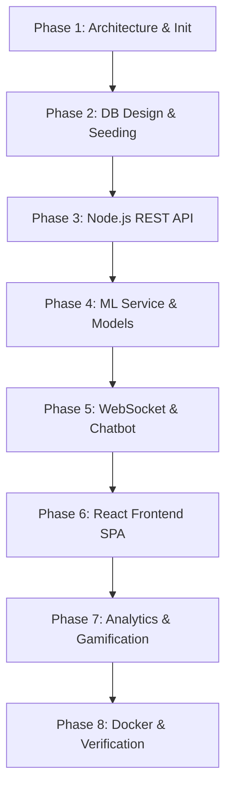

# MovieAI — AI-Powered Movie Recommendation System

## 1. Introduction

In the modern digital entertainment landscape, users are faced with an overwhelming volume of content across various streaming platforms. This abundance often leads to **"choice paralysis"** or **"analysis paralysis,"** where users spend more time searching for something to watch than actually enjoying the content. Traditional recommendation engines typically rely on static user ratings or generic category filters, failing to adapt to a user's current emotional state or provide transparent reasoning for their suggestions.

**MovieAI** is a next-generation, full-stack movie recommendation platform designed to overcome these challenges. By combining state-of-the-art machine learning algorithms, real-time synchronization, and a premium glassmorphic user experience, MovieAI offers a multi-dimensional approach to movie discovery.

### 1.1 Core Value Proposition

MovieAI provides a highly personalized, dynamic, and intuitive entertainment portal through three key pillars:

1. **Multi-Dimensional Discovery**: Unlike standard platforms, MovieAI leverages a hybrid recommendation engine. It combines text-based semantic features (analyzing plot descriptions, cast, and metadata using TF-IDF and Cosine Similarity) with real-world user preferences, global popularity indices, and an interactive **Mood Picker** that maps emotional states directly to tailored movie genres.
2. **Explainable AI (XAI)**: To build user trust and engagement, the platform features transparent, natural-language match justifications (e.g., *"Matches your high rating for similar Action films"*), helping users understand the reasoning behind each recommendation.
3. **Interactive & Gamified Ecosystem**: Beyond simple browsing, MovieAI incorporates a comprehensive user statistics dashboard powered by interactive charts (visualizing genre preferences and watch times) alongside a badging and achievement system designed to reward active user engagement.

---

## 2. Project Synopsis

| Project Field | Specification |
|---|---|
| **Project Title** | MovieAI — AI-Powered Movie Recommendation System |
| **Architecture** | Decoupled 3-Tier Microservices Architecture (Frontend, API Server, ML Microservice) |
| **Core Technologies** | React.js (Vite), CSS3 (Glassmorphism), Node.js, Express, MongoDB, Python (FastAPI), Scikit-Learn |
| **Recommendation Signals** | Content-Based (TF-IDF), Collaborative Rating & Popularity Boosting, Mood-Based Parsing |
| **Integration & Real-Time** | WebSockets (Socket.io) for live sync, Chart.js for data visualization, Template-based Explainable AI |

### 2.1 Project Abstract

**MovieAI** is a comprehensive, production-ready full-stack application designed to solve choice paralysis in digital media consumption. Built using a decoupled microservices architecture, the application separates client interaction, server management, and machine learning computations into specialized, high-performance layers. 

The client-side interface is built with **React.js and Vite**, using a custom **Vanilla CSS3 Glassmorphism** design system to deliver a dark-themed, immersive cinema aesthetic. Real-time updates—such as instant wishlist syncing—are handled via **Socket.io** connection protocols, while user-centric analytics (e.g., watch progression and genre distribution) are visualized through **Chart.js**.

The backend ecosystem consists of two core components:
1. **Express & Node.js Gateway**: Handles secure user management (via HTTP-Only JWT cookies), database interactions (using Mongoose/MongoDB), and handles role-based authorization for administrative control.
2. **Python & FastAPI ML Service**: Runs a localized recommendation pipeline. It computes semantic text similarities on movie summaries using **TF-IDF vectorization and Cosine Similarity**. These scores are then combined with rating, language, and popularity features in a custom hybrid ranking algorithm. 

To ensure complete robustness without external API costs or setup limits, MovieAI incorporates a local generator pre-seeded with **1000+ movies**, a pure Python mathematical fallback (**Jaccard Similarity**), and a randomized template-based engine that simulates natural-language recommendations justifications.

---

## 3. Software Requirements

The MovieAI platform consists of three core components, each relying on specific environment runtimes, libraries, and frameworks to achieve modular and scalable performance.

### 3.1 Prerequisites & System Runtimes

Before running the services, the following system software must be installed on the host machine:

- **Node.js**: `v18.0.0` or higher (recommended LTS version) for hosting the primary API Gateway and frontend builder.
- **npm (Node Package Manager)**: Bundled with Node.js, used for dependency management.
- **Python**: `v3.9` or higher (recommended `v3.10` or `v3.11`) to run high-performance machine learning models and server endpoints.
- **MongoDB**: `v5.0` or higher (running locally on default port `27017` or via MongoDB Atlas URI) for persistence of user details, rating configurations, wishlists, and metadata caches.
- **Redis Cache (Optional/Production)**: Running locally on default port `6379` for session caching and pre-computed recommendation lists.

---

### 3.2 Frontend Dependencies (React SPA Client)

The React client-side framework runs on **Vite** and integrates the following package requirements:

| Package | Version | Purpose |
|---|---|---|
| `react` / `react-dom` | `^19.2.6` | Client view layer rendering and state synchronization |
| `vite` | `^8.0.12` | Main module bundles compiler and dev server |
| `@reduxjs/toolkit` | `^2.11.2` | Core application slice controllers and state stores |
| `react-redux` | `^9.2.0` | Global state binder hooks (`useSelector`, `useDispatch`) |
| `react-router-dom` | `^7.15.0` | Declarative page router controller |
| `axios` | `^1.16.0` | Promise-based HTTP client for API resource calls |
| `socket.io-client` | `^4.8.3` | Real-time WebSocket connection to backend |
| `chart.js` / `react-chartjs-2` | `^4.5.1` / `^5.3.1` | User history preference charts rendering |
| `@heroicons/react` | `^2.2.0` | High-quality responsive visual vector icons |

---

### 3.3 Backend Dependencies (Node.js/Express API Gateway)

The primary web server is built on **Express** and handles JWT authentication, database operations, and system schedules:

| Package | Version | Purpose |
|---|---|---|
| `express` | `^4.18.3` | REST API routes handling and middleware dispatcher |
| `mongoose` | `^8.2.4` | MongoDB Object Data Modeling (ODM) library |
| `socket.io` | `^4.7.5` | Socket server handling real-time chat & system updates |
| `jsonwebtoken` | `^9.0.2` | JSON Web Token generator & validation handler |
| `bcryptjs` | `^2.4.3` | User password hashing algorithm |
| `helmet` | `^7.1.0` | Secure HTTP header configurator |
| `express-rate-limit` | `^7.2.0` | Basic rate limiter middleware to prevent DDoS attacks |
| `compression` | `^1.7.4` | Response compression (Gzip/Deflate) middleware |
| `express-validator` | `^7.0.1` | Input validation sanitization schemas |
| `winston` / `morgan` | `^3.13.0` / `^1.10.0` | Backend event logs & HTTP requests logging |
| `dotenv` | `^16.4.5` | Environment variable loader configuration |
| `ioredis` | `^5.3.2` | Fast, robust Redis database driver client |
| `nodemon` (Dev) | `^3.1.0` | Auto-restart node script utility during development |

---

### 3.4 ML Service Dependencies (Python FastAPI Recommendation Engine)

The machine learning computations and recommendation pipelines are executed via FastAPI using the following libraries:

| Package | Version | Purpose |
|---|---|---|
| `fastapi` | `0.110.0` | Modern, high-performance web API framework |
| `uvicorn` | `0.29.0` | Fast ASGI server running the FastAPI application |
| `pydantic` | `2.6.4` | Structured data validation and settings schemas parsing |
| `pandas` | `2.2.1` | Data manipulation, dataframes, and matrix transformations |
| `numpy` | `1.26.4` | High-performance numerical computations |
| `scikit-learn` | `1.4.1.post1` | TF-IDF Vectorizer and linear kernel Cosine computations |
| `python-dotenv` | `1.0.1` | Env parser loading configuration constants |

---

## 4. Step-by-Step Project Implementation Summary

The development of the MovieAI platform was executed systematically across distinct lifecycle phases, ensuring high coupling within services and clear decoupling across microservice endpoints.

### Phase 1: Architecture Definition & Environment Setup
- **Objective**: Standardize microservice structures and configure separate runtime folders.
- **Tasks**:
  1. Configured parent project folder containing `client` (React), `server` (Node.js), and `ml-service` (Python).
  2. Setup configuration templates (`.env.example`, `.gitignore`).
  3. Created virtual environments (`venv`) for Python and initialized Node packages.

### Phase 2: Database Schema & Mock Data Seeding
- **Objective**: Establish the persistent storage layer and seed localized test data.
- **Tasks**:
  1. Drafted document models using Mongoose ODM: `User`, `Movie`, `Wishlist`, `WatchHistory`, `Rating`, `Badge`, and `ChatMessage`.
  2. Built `generateMockData.js` to simulate 1000+ detailed movies featuring full cast, crew, genre tags, popularity, and video references.
  3. Created `seed.js` script to populating the DB with structured admin credentials, users, and rating transactions to boot recommendations.

### Phase 3: Backend REST API Gateway (Node.js/Express)
- **Objective**: Implement authentication, security headers, metadata control, and user profiles.
- **Tasks**:
  1. Developed JWT-based auth routes supporting secure HTTP-Only cookie verification.
  2. Implemented route middleware: `Helmet` headers, `CORS` credential permissions, and basic `express-rate-limit` restrictions.
  3. Built RESTful CRUD controllers for rating movies, updating wishlists, writing reviews, and loading watch history logs.

### Phase 4: Machine Learning Recommendation Engine (FastAPI)
- **Objective**: Construct high-performance recommendation scoring models.
- **Tasks**:
  1. Constructed a FastAPI instance using a startup cache lifecyle handler to preload movie collections into memory.
  2. Built the **Content-Based Filtering** pipeline using scikit-learn's `TfidfVectorizer` and dot-product `linear_kernel` on movie titles/synopses.
  3. Programmed the **Hybrid Scorer** incorporating text matching, popularity scales, rating weights, and user language preferences.
  4. Added a pure Python Jaccard similarity fallback to guarantee service availability if scikit-learn fails.

### Phase 5: WebSockets & Interactive Chatbot Gateway
- **Objective**: Setup persistent communication lanes.
- **Tasks**:
  1. Integrated `socket.io` with Node's HTTP wrapper server.
  2. Designed real-time event protocols to broadcast list updates (e.g. wishlist changes) across open clients.
  3. Built an interactive Chatbot gateway parsing keywords, querying recommendation routes on user demand, and providing natural-language chat suggestions.

### Phase 6: Frontend SPA UI Development (React/Vite)
- **Objective**: Create a responsive client dashboard styled with premium visual features.
- **Tasks**:
  1. Compiled a single-page application router structure (`react-router-dom`) with global Redux slices.
  2. Styled interactive pages using a custom **Vanilla CSS3 Glassmorphism** design (frost blur, translucent cards, smooth gradients).
  3. Designed client components: movie sliders, TMDB-sourced video trailer modal popups, and the Mood Selector panel.

### Phase 7: Analytics Dashboard & Gamification Engine
- **Objective**: Retain users and present clear interactive data.
- **Tasks**:
  1. Linked `Chart.js` canvas displays mapping a user's movie genres breakdown and rating timelines.
  2. Formulated user progression scripts: adding XP points (+10 on watch, +5 on rate) and tracking badge achievements (e.g. "Critic", "First Watch").
  3. Synchronized points and achievement milestones in real-time using Socket notifications.

### Phase 8: Deployment Configuration & Deployment Checks
- **Objective**: Prepare the complete system configuration for simple orchestration.
- **Tasks**:
  1. Wrote `docker-compose.yml` to bundle client, server, and ML services into multi-container deployment models.
  2. Verified API pathways and local database fallback routines.

