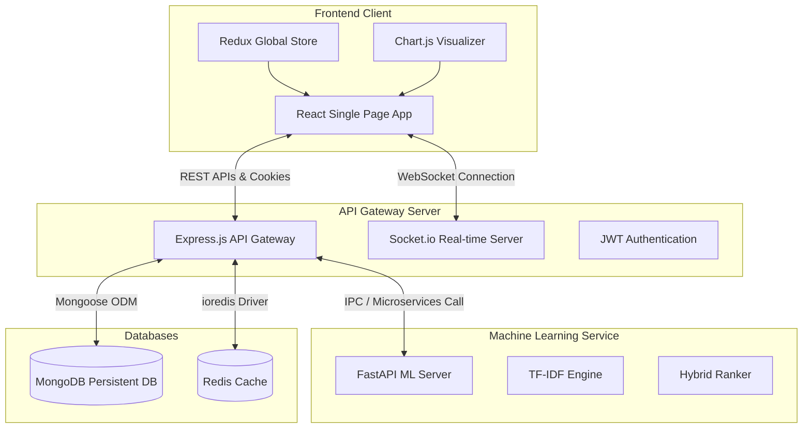

# 🎬 MovieAI — AI-Powered Movie Recommendation System

<div align="center">

[](https://react.dev/)
[](https://nodejs.org/)
[](https://www.mongodb.com/)
[](https://fastapi.tiangolo.com/)
[](https://www.python.org/)
[](https://socket.io/)

**A full-stack, decoupled 3-tier microservices platform designed to solve choice paralysis in digital media consumption by blending semantic AI, user emotional state, real-time communication, and gamified statistics.**

</div>

---

## 📌 Table of Contents
- [📖 Overview](#-overview)
- [✨ Key Features](#-key-features)
- [🏗️ System Architecture](#️-system-architecture)
- [💻 Tech Stack](#-tech-stack)
- [🚀 Quick Start (Local Setup)](#-quick-start-local-setup)
- [🐳 Docker Configuration](#-docker-configuration)
- [👤 Demo Credentials](#-demo-credentials)
- [🔧 Database Seeding & Maintenance](#-database-seeding--maintenance)

---

## 📖 Overview

In today's digital landscape, users spend an overwhelming amount of time searching for what to watch rather than enjoying it—a phenomenon known as **"choice paralysis."** 

**MovieAI** is a next-generation recommendation portal that addresses this by combining a highly-scalable architecture with **Explainable AI (XAI)**. It uses content-based semantic matching (powered by TF-IDF & Cosine Similarity) along with user sentiment analysis and collaborative signals to deliver transparent, justified recommendations (e.g., *"Matches your high rating for similar Action films"*). The frontend is wrapped in a premium **glassmorphic dark-theme** user interface for a cinematic experience.

---

## ✨ Key Features

*   **🧠 Hybrid Recommendation Engine**: Integrates TF-IDF vectorization with global popularity metrics, user watch history, and collaborative rating signals. Falls back gracefully to Jaccard Similarity if required.
*   **🎭 Emotional Mood Picker**: Instantly maps users' current emotional states (e.g., Happy, Sad, Thriller, Romantic) to tailored, real-time movie lists.
*   **💬 Interactive AI Chatbot**: A WebSocket-powered chatbot that processes search commands and suggests films interactively in a conversational interface.
*   **📊 User Preference Analytics**: Features interactive dashboards (using `Chart.js`) showcasing genre distributions, watch histories, and rating analytics.
*   **🏆 Gamification & Milestones**: Earn XP (e.g., `+10 XP` for watching, `+5 XP` for rating) and unlock customized badges (e.g., *"Critic"*, *"First Watch"*) pushed in real-time via WebSockets.
*   **🎬 Video Trailer Previews**: Modern modal popups with auto-preview functionality similar to major streaming services.

---

## 🏗️ System Architecture

MovieAI is structured as a decoupled microservices architecture to ensure high performance and service separation:



---

## 💻 Tech Stack

### Frontend Client
*   **Core**: React (v19) & Vite (v8)
*   **State Management**: Redux Toolkit & React-Redux
*   **Styling**: Vanilla CSS3 (Custom Glassmorphism Design System)
*   **Real-time & Charts**: Socket.io Client & Chart.js

### API Gateway Server
*   **Runtime**: Node.js & Express.js
*   **Database ODM**: Mongoose (MongoDB)
*   **Security & Compression**: Helmet, Express Rate Limiter, Compression
*   **Real-time Communication**: Socket.io

### Machine Learning Service
*   **Framework**: Python (v3.9+) & FastAPI
*   **Libraries**: Pandas, NumPy, Scikit-learn (TF-IDF Vectorizer & Cosine Similarity Matrix)
*   **Server Gateway**: Uvicorn ASGI

---

## 🚀 Quick Start (Local Setup)

To run the complete system locally, follow the instructions below to run the three microservices in **three separate terminals**.

### 📋 Prerequisites
Ensure you have the following installed on your machine:
*   **Node.js** (v18.0.0 or higher)
*   **Python** (v3.9 or higher)
*   **MongoDB** (running locally on port `27017` or via MongoDB Atlas URI)
*   *Optional*: **Redis** (running locally on port `6379`)

---

### Step 1: Backend Gateway Server (Node.js)
1. Navigate to the server folder:
   ```bash
   cd server
   ```
2. Install dependencies:
   ```bash
   npm install
   ```
3. Set up your environment variables. Copy `.env.example` in the root folder to `server/.env` and fill in details if required (contains default fallback config for local MongoDB out-of-the-box).
4. Seed the database with mock movies and default users (see [Database Seeding](#-database-seeding--maintenance)).
5. Start the development server:
   ```bash
   npm run dev
   ```
   *Runs on [http://localhost:5000](http://localhost:5000)*

---

### Step 2: ML Recommendation Service (Python)
1. Navigate to the machine learning folder:
   ```bash
   cd ml-service
   ```
2. Create and activate a Python virtual environment:
   ```bash
   python -m venv venv
   # Windows Activation
   .\venv\Scripts\activate
   # macOS/Linux Activation
   source venv/bin/activate
   ```
3. Install the required libraries:
   ```bash
   pip install -r requirements.txt
   ```
4. Start the FastAPI microservice:
   ```bash
   uvicorn app.main:app --reload --port 8000
   ```
   *Runs on [http://localhost:8000](http://localhost:8000)*

---

### Step 3: Frontend Client (React)
1. Navigate to the client folder:
   ```bash
   cd client
   ```
2. Install client dependencies:
   ```bash
   npm install
   ```
3. Start the Vite development build server:
   ```bash
   npm run dev
   ```
   *Runs on [http://localhost:5173](http://localhost:5173)*

---

## 🐳 Docker Configuration

Alternatively, you can boot the entire stack (Client, Server, ML Service, and MongoDB) using a single command using Docker Compose:

1. Ensure Docker Desktop is installed and running.
2. Run the build and startup command from the root directory:
   ```bash
   docker-compose up --build
   ```
3. Open [http://localhost:5173](http://localhost:5173) in your browser.

---

## 👤 Demo Credentials

For testing the application, you can log in using the pre-seeded account:
*   **Email**: `test@movieai.com`
*   **Password**: `test@123`

---

## 🔧 Database Seeding & Maintenance

The system includes helper scripts in the `server` directory to maintain data consistency:

*   **Generate 1000+ Mock Movies**:
    ```bash
    node server/src/scripts/generateMockData.js
    ```
*   **Full Database Seeding (Wipes collections and creates test users, ratings, and movies)**:
    ```bash
    node server/src/scripts/seed.js
    ```
*   **Verify Index Configurations**:
    ```bash
    node server/verify_indexes.js
    ```

---

*© MovieAI — AI-Powered Movie Recommendation System*
